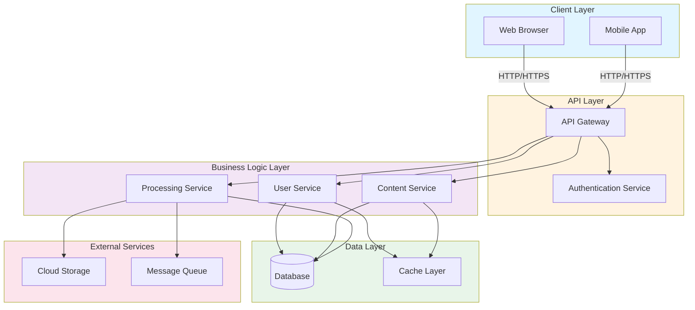

# Architecture Overview

## System Architecture

This document provides a visual overview of the Maypo system architecture and its components.

## Component Descriptions

### Client Layer
- **Web Browser**: Main web application interface
- **Mobile App**: Native mobile application

### API Layer
- **API Gateway**: Central entry point for all client requests, handles routing and request distribution
- **Authentication Service**: Manages user authentication and authorization

### Business Logic Layer
- **User Service**: Handles user management and profiles
- **Content Service**: Manages content creation and delivery
- **Processing Service**: Handles business logic and background processing

### Data Layer
- **Database**: Primary data store for persistent data
- **Cache Layer**: Redis or similar for performance optimization

### External Services
- **Cloud Storage**: File storage and media management
- **Message Queue**: Asynchronous task processing and communication

## Data Flow

1. Clients send requests through the API Gateway
2. Gateway routes requests to appropriate services
3. Services authenticate via the Authentication Service
4. Services process requests and interact with the database and cache
5. Long-running tasks are queued for asynchronous processing
6. Results are cached for improved performance

## Deployment

- Services are deployed as containerized microservices
- API Gateway serves as the single entry point
- Database and cache are managed separately
- External services are integrated via APIs
